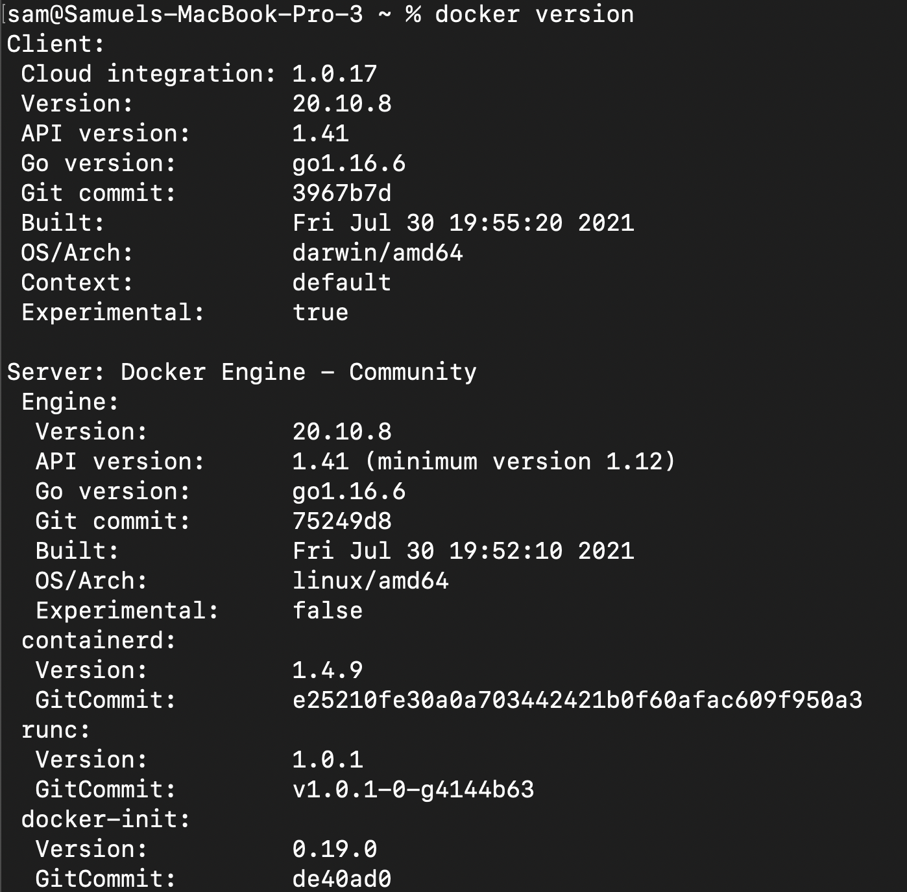
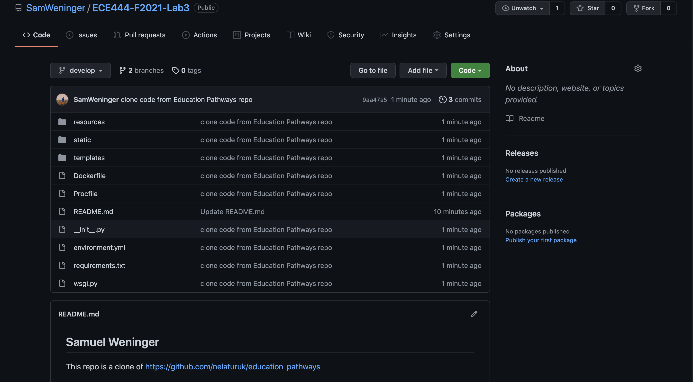
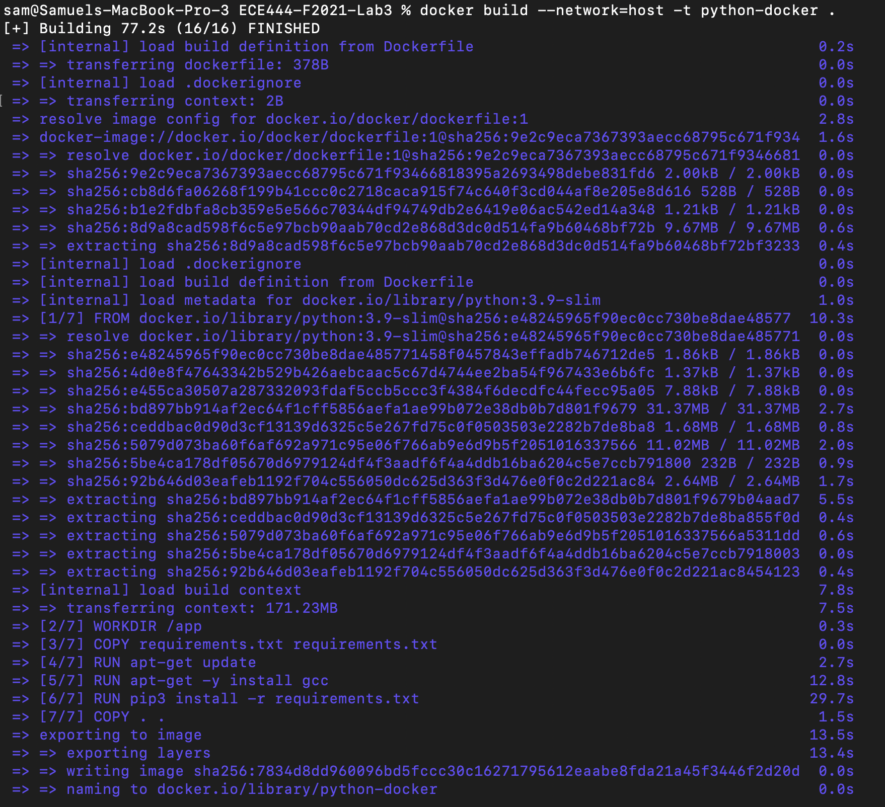
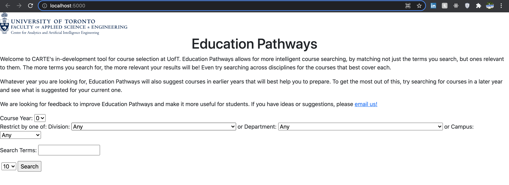
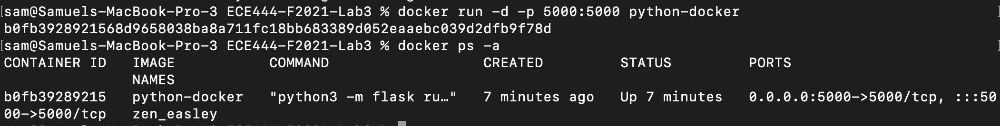

## Samuel Weninger
This repo is a clone of https://github.com/nelaturuk/education_pathways
***

### Activity 1

### Activity 2

### Activity 3

### Activity 4

### Activity 5

* Functional Requirement: The primary functional requirement of the Education Pathways application is to take user parameters about course offerings (i.e. course year, department, campus location/offering, course year/term) and return course data, including a courses title, code, division, description, department and course level.

* Non-functional Requirement: A non-functional requirement of the Education Pathways application is the ability to view all course offerings and data from the years of 2020-2022 (inclusive) with relatively low response time (I observed results loaded in around <1).

* The Education Pathways application does not have enough data: only course offerings and related data can be accessed within the timeframe of 2020-2022, so if a student wanted to plan ahead for years beyond this current school year they would be unable to. Additionally the user interface used to display the course data is hard to read, and could the organization of this data could be improved.
